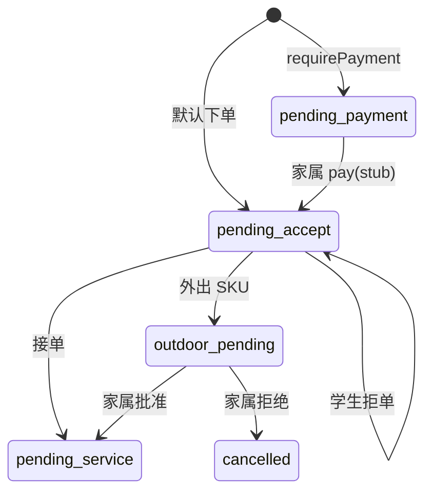

# 暖伴勤工 · 产品资料

**版本**：V1 · 2025-05  
**技术基线**：uni-app（微信 + H5）+ PocketBase + Docker Compose  
**实现对照**：`packages/pocketbase/pb_hooks/nuanban.pb.js`、`packages/miniapp/src/pages.json`

> 本文档区分 **产品目标**（长期应然）与 **V1 已落地**（当前代码）。避免把规划中的页面或流程写成「已上线」。

---

## 1. 产品定位

### 1.1 一句话

**暖伴勤工**连接福利院/养老院老人、家属与高校勤工学生，按 **服务 SKU** 明码标价提供陪护与生活协助；**家属（或政策允许时平台）收款**，订单完成后 **平台侧记录结算**；**一个微信小程序 + H5** 承载老人 / 家属 / 学生三端，**管理在 PocketBase Admin**，**不设监督员端**。

### 1.2 核心价值

| 角色 | 痛点 | 平台价值 |
|------|------|----------|
| 老人 | 找可靠陪护难 | 附近学生、选 SKU 下单、订单可查 |
| 家属 | 异地无法到场、付款分散 | 绑定老人、代付、外出审批 |
| 学生 | 勤工渠道少 | 待接单池、接单、排班记录（完整流程分期） |
| 机构 | 档案与派单分散 | Admin 维护老人/SKU/订单/导出 |

### 1.3 长期边界（不做）

| 不做 | 说明 |
|------|------|
| 监督员 App / 督导后台 | 合规靠机构 Admin + 导出，不做第四端 |
| 按校多租户 SaaS | 全平台一套库；`school_dict` 仅统计与合作配置 |
| 三端拆成三个小程序 | 始终 **单 AppID、分包分角色** |

---

## 2. 设计原则（最新共识）

1. **极简栈、低运维**：后端仅 PocketBase（SQLite + Admin + Hooks），不用 NestJS + PostgreSQL + 独立 Vue 后台。  
2. **单应用多角色**：`users` + `user_roles`；客户端 `activeRole` + 分包隔离。  
3. **撮合三种方式并存**（可组合，非互斥）：  
   - **机构派单**：Admin 写 `orders` / `schedules`；  
   - **老人找学生**：老人端附近列表 → 选 SKU 下单（可带 `studentId`）；  
   - **学生找需求**：学生端看待接单订单 → 接单。  
4. **支付**：业务上以 **家属支付** 为主；老人下单默认可走「先服务后付」演示路径，需预付时进入 `pending_payment`。  
5. **结算**：订单完成后产生 `settlements` 记录；V1 **不自动打款**，以对账导出为主。  
6. **学校合作**：配置「某校 ↔ 某机构」及「指定服务老人」；**过滤逻辑为二期**（V1 仅数据与 Admin 维护）。  
7. **位置**：V1 用 **Haversine + 默认 5km**；学生/老人坐标存在 `user_roles` / `elders`。  
8. **开放与成本**：MIT 栈、自托管 `pb_data` 备份即可；目标月费约 ¥30～80（见 [TECH_STACK_SIMPLE.md](./TECH_STACK_SIMPLE.md)）。

---

## 3. 用户与角色

### 3.1 角色矩阵

| 角色 | 客户端 | 管理端 | 说明 |
|------|--------|--------|------|
| 老人 | 小程序 / H5 | — | 找陪护、预约、看订单 |
| 家属 | 小程序 / H5 | — | 代付、外出审批（绑定老人见二期完善） |
| 学生 | 小程序 / H5 | — | 待接单、接单/拒单 |
| 机构管理员 | — | PocketBase Admin | 本机构档案、派单、SKU、导出 |
| 平台管理员 | — | PocketBase Admin | 多机构、合作、全局配置 |

小程序 **不包含** `org_admin` / `platform_admin` 界面；管理权限通过 Admin 账号与集合权限区分（V1 以超级用户/人工为主）。

### 3.2 单 App、多角色

- 一个账号多条 `user_roles`（`elder` | `family` | `student`）。  
- 登录后确定 **`activeRole`**，请求可带 `X-Active-Role`（**V1 服务端 Hooks 尚未按此头强校验**）。  
- 多角色时经 `pages/common/role-select` 选择；切换应 **仅改本地 store**，勿依赖已废弃的 Nest `/auth/switch-role`。

### 3.3 注册与审核（目标 vs V1）

| 角色 | 产品目标 | V1 实现 |
|------|----------|---------|
| 老人 | 机构预建档 / 手机号匹配 | `POST /api/nuanban/auth/register` 写 `user_roles`；**无** 绑定码流程 |
| 家属 | 绑定码 / 扫码绑定 `family_elder_bindings` | 同上；绑定关系靠 **seed 或 Admin** |
| 学生 | 学校、学号；`pending` → Admin 审 `active` | register 时 `student` → `pending`；**客户端守卫**拦未审核学生 |

---

## 4. 服务与商品（SKU）

### 4.1 数据

- **`service_categories`**：陪护、康复协助、陪伴聊天、外出陪同等大类。  
- **`service_items`**（SKU）：`price_cents`、`duration_minutes`、`requires_outdoor_approval`、`status`（上架/下架）。

### 4.2 规则

- 下单金额以 SKU 为准，写入 `orders.amount_cents`。  
- 需外出审批的 SKU：订单进入 **`outdoor_pending`**，并创建 **`outdoor_approvals`**（`pending_family`）。  
- 机构专属价、服务包：字段可扩展；V1 演示为 **统一价、单笔 SKU 订单**。

---

## 5. 订单、撮合与状态机

### 5.1 订单来源（`orders.source`）

| 值 | 含义 | V1 |
|----|------|-----|
| `elder_self` | 老人（或代其操作账号）下单 | Hook `POST /api/nuanban/elder/orders` |
| `family` | 家属代下单 | 规划；可 Admin 改 source |
| `admin_assign` | 机构派单 | Admin 直接写库 |
| `student_apply` | 学生申请/抢单前置 | 规划；当前为接单改 `student_user` |

### 5.2 三种撮合（产品能力）

```
┌─────────────────┐     ┌──────────────────┐     ┌─────────────────┐
│ 机构派单         │     │ 老人找学生        │     │ 学生找订单       │
│ Admin 指定      │     │ 附近列表+下单     │     │ 待接单池+接单    │
│ orders/schedules│     │ elder/orders     │     │ student/accept  │
└─────────────────┘     └──────────────────┘     └─────────────────┘
```

**V1 已接通**：老人下单、学生接单/拒单、家属模拟支付、外出审批、Admin 手工派单（写集合）。  
**未接通**：学生主动「申请服务」独立流程、老人端确认完成、签到改状态。

### 5.3 订单状态（库表枚举）

`orders.status` 完整枚举：

`draft` · `pending_payment` · `pending_accept` · `outdoor_pending` · `pending_service` · `in_service` · `pending_confirm` · `completed` · `cancelled` · `refunding`

**V1 Hooks 实际驱动的子集**（其余状态可 Admin/seed 写入，无自动流转 API）：

| 状态 | 含义 | 进入方式（V1） |
|------|------|----------------|
| `pending_payment` | 待家属支付 | 下单时 `requirePayment: true` |
| `pending_accept` | 待学生接单 | 默认下单；支付后；拒单回退 |
| `outdoor_pending` | 外出待家属批 | SKU 需外出；支付后或接单后 |
| `pending_service` | 已接单，待服务 | 接单通过或外出批准；创建 `schedules` |
| `cancelled` | 已取消 | 外出拒绝 |

**尚未有 Hook 的后续状态**：`in_service` → `pending_confirm` → `completed`（对应签到、服务记录、老人确认）。

### 5.4 状态流转图（V1 已实现部分）



### 5.5 支付（`payment_status`）

| 字段 | 说明 |
|------|------|
| `unpaid` / `paid` / `refunding` / `refunded` | 与微信实装对接时沿用 |

**V1 规则**（`nuanban.pb.js`）：

- 老人下单 **默认** `payment_status=paid`、`status=pending_accept`（便于演示全流程）。  
- `requirePayment=true` → `pending_payment` + `unpaid`。  
- `POST /api/nuanban/family/orders/{id}/pay`：**模拟支付**，仅当 `status=pending_payment`。

**产品目标**：上线后家属微信支付进平台商户号；老人下单若政策要求预付 → `pending_payment`。

### 5.6 结算（`settlements`）

| 产品目标 | V1 |
|----------|-----|
| 完成后记学生劳务费、可对账导出 | 集合已有；**无** 订单完成自动写 settlement 的 Hook |
| 机构分成 | 未建模字段；seed 示例为学生约 70% 金额 |

---

## 6. 位置与匹配

### 6.1 老人找陪护

- **API**：`GET /api/nuanban/elder/caregivers/nearby?lat=&lng=&radiusKm=5`  
- **规则**：`user_roles.role=student` 且 `status=active`；用角色上的 `latitude`/`longitude` 做 Haversine。  
- **返回**：脱敏展示名、学校名、距离。  
- **二期**：按 `school_cooperation`、`school_designated_elder`、机构范围过滤（**V1 未做**）。

### 6.2 学生找需求

- **API**：`GET /api/nuanban/student/orders/pending` — 全局 `status=pending_accept`。  
- **接单**：`POST .../student/order-requests/{id}/accept`  
- **拒单**：`POST .../reject`（清空 `student_user`，回 `pending_accept`）  
- **说明**：`listNearbyElders`（按老人档案距离）在客户端 API 层有定义，**当前页面未使用**；`discover/list` 页展示的是待接单列表。

### 6.3 机构派单

- Admin 创建/编辑 `orders`、`schedules`，指定 `student_user`、`scheduled_at`。  
- 不经过小程序接单流程。

---

## 7. 排班、外出、安全

| 能力 | 产品目标 | V1 |
|------|----------|-----|
| `schedules` | 排班、签到、服务中状态 | 接单/外出通过后 **自动创建**一条 `pending_service` |
| GPS 签到 | 学生到点签到 → `in_service` | 未实现 |
| 服务日志 | 学生填写记录 | 未实现 |
| 外出审批 | 家属批/拒 | `POST /api/nuanban/family/outdoor/{id}/approve` |
| 老人 SOS | 记录位置并通知机构 | 客户端占位；无后端落库 |

---

## 8. 学校合作（非租户）

### 8.1 原则

- **一套数据库、一个 Admin**，不按学校拆实例。  
- `school_dict`：学校字典；学生 `user_roles.school` 关联。  
- `school_cooperation`：学校 ↔ 机构合作开关。  
- `school_designated_elder`：合作项目指定服务老人。

### 8.2 V1 与二期

| 项 | V1 | 二期 |
|----|-----|------|
| Admin 维护合作与指定老人 | 是（seed + 手工） | — |
| 附近学生/待接单按合作过滤 | 否 | Hooks + filter |
| 按校独立后台域名 | 否（不做） | — |

---

## 9. 管理端（PocketBase Admin）

访问：`http://<host>:8090/_/`

| 能力 | 说明 |
|------|------|
| 老人/机构/社区 | `elders`、`organizations`、`communities` |
| SKU | `service_categories`、`service_items` |
| 订单与派单 | `orders`、`schedules` |
| 合作与指定老人 | `school_cooperation`、`school_designated_elder` |
| 角色审核 | `user_roles`（学生 `pending`→`active`） |
| 导出 | `export_tasks`（V1 可手工触发/seed 示例） |

**不做**：监督员工作台、独立 `packages/admin-web`（仓库内为历史参考）。

---

## 10. 客户端（uni-app）

### 10.1 交付形态

| 形态 | 用途 |
|------|------|
| 微信小程序 | 主渠道 |
| H5 | 开发调试、非微信环境；与小程序 **同仓库** `packages/miniapp` |

### 10.2 V1 已注册页面（以 `pages.json` 为准）

**主包 `pages/common`**：`launch` · `login` · `role-select` · `register`

| 分包 | 页面 | 功能 |
|------|------|------|
| `package-elder` | home, caregivers/list\|detail, order/create\|list\|detail | 找陪护、预约、我的服务 |
| `package-family` | home, order/pay, outdoor/approve | 首页、模拟支付、外出审批 |
| `package-student` | home, discover/list, order/request | 首页、待接单列表、接单详情 |

**规划未入库的页面**（勿在验收中要求）：家属绑定/账单、学生排班/签到/收入、老人设置大字号、用户协议页等 — 见 [MINIAPP_ROUTING.md](./MINIAPP_ROUTING.md) 的「规划」表。

### 10.3 登录（V1）

| 方式 | API | 说明 |
|------|-----|------|
| 微信（演示） | `POST /api/nuanban/wx-login` | 用 `code` 生成 `wx_*@nuanban.dev`，**非**真实 code2session |
| 开发登录 | `POST /api/nuanban/dev-login` | 仅邮箱，**不校验密码**；须先 `./scripts/seed-demo.sh` |
| 当前用户 | `GET /api/nuanban/auth/me` | 返回 `roles[]` |

测试账号见 `packages/pocketbase/SEED.md`。

---

## 11. V1 实现清单（验收用）

### 11.1 后端 Hooks（`nuanban.pb.js`）

| 方法 | 路径 |
|------|------|
| POST | `/api/nuanban/wx-login` |
| POST | `/api/nuanban/dev-login` |
| GET | `/api/nuanban/auth/me` |
| POST | `/api/nuanban/auth/register` |
| GET | `/api/nuanban/elder/caregivers/nearby` |
| POST | `/api/nuanban/elder/orders` |
| GET | `/api/nuanban/student/orders/pending` |
| POST | `/api/nuanban/student/order-requests/{id}/accept` |
| POST | `/api/nuanban/student/order-requests/{id}/reject` |
| POST | `/api/nuanban/family/orders/{id}/pay` |
| POST | `/api/nuanban/family/outdoor/{id}/approve` |
| POST | `/api/nuanban/seed-demo` | 演示数据（`seed_demo.pb.js`） |

### 11.2 数据与部署

- 15 个业务集合：`pb_schema.json`（导入须 **Merge** 或 phase1+phase2）  
- Docker：`docker compose up -d pocketbase`  
- 文档与脚本：`scripts/pb-fresh-start.sh`、`scripts/seed-demo.sh`

### 11.3 明确不在 V1 验收范围

- 微信支付 / 退款 V3  
- 订单完成态自动结算、批量打款  
- 学校合作范围过滤、PostGIS  
- 模板消息 / SOS 后台  
- 行级集合权限与全量状态机 Hooks  
- NestJS API、PostgreSQL、Element Admin 部署  

---

## 12. 二期路线图

1. 微信 `code2session`、支付与退款回调 Hooks  
2. 订单 `in_service` → `completed` + 签到 / 服务日志  
3. 完成后写 `settlements` + 导出流水线  
4. `school_cooperation` 参与匹配与列表 filter  
5. 家属绑定老人、代下单、账单列表  
6. 集合 API 规则 + `X-Active-Role` 服务端校验  
7. 老人端无障碍（大字号）、消息推送  

---

## 13. 数据实体索引

| 集合 | 用途 |
|------|------|
| `school_dict` | 学校字典 |
| `organizations` / `communities` | 机构与服务点 |
| `elders` | 老人档案 |
| `users` + `user_roles` | 账号与角色 |
| `family_elder_bindings` | 家属—老人 |
| `service_categories` / `service_items` | SKU |
| `orders` | 订单 |
| `schedules` | 排班服务单 |
| `outdoor_approvals` | 外出审批 |
| `settlements` | 结算记录 |
| `school_cooperation` / `school_designated_elder` | 院校合作 |
| `export_tasks` | 导出任务 |

字段详见 `packages/pocketbase/COLLECTIONS.md`。

---

## 14. 名词表

| 名词 | 含义 |
|------|------|
| SKU | `service_items` 可售项 |
| 撮合 | 机构派单 / 老人选学生 / 学生接单 |
| 平台结算 | 订单完成后 `settlements` 记录（非即时分账） |
| activeRole | 客户端当前业务角色 |
| Merge 导入 | PocketBase 导入 schema 时合并内置 `users` 集合 |

---

**相关文档**：[TECH_STACK_SIMPLE.md](./TECH_STACK_SIMPLE.md) · [DEPLOY.md](./DEPLOY.md) · [API.md](./API.md) · [LOGIN_STATE.md](./LOGIN_STATE.md) · [MINIAPP_ROUTING.md](./MINIAPP_ROUTING.md)
