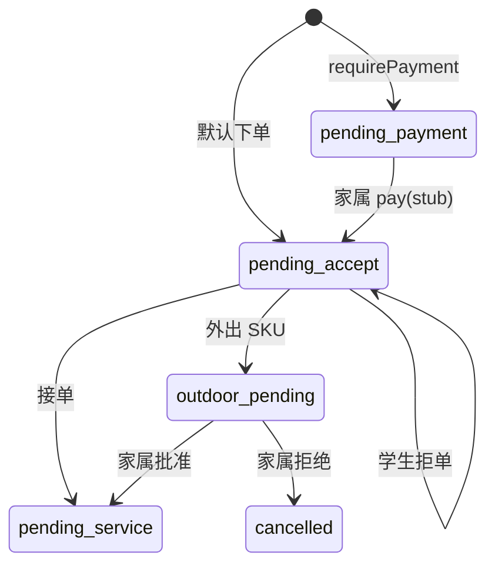

<div style="text-align:center;padding:80px 0;">

# 暖伴勤工

## 完整文档手册

V1 · uni-app + PocketBase

</div>

\newpage

## 目录

1. 文档说明  
2. 第一部分 产品规格  
3. 第二部分 技术架构  
4. 第三部分 系统架构  
5. 第四部分 部署指南  
6. 第五部分 快速上手  
7. 第六部分 数据导入与演示数据  
8. 第七部分 后台登录  
9. 第八部分 API 说明  
10. 第九部分 登录与多角色  
11. 第十部分 小程序路由  
12. 第十一部分 故障排查  
13. 附录  

\newpage


# 文档说明


**项目名称**：暖伴勤工  
**版本**：V1 精简栈（产品资料已与代码对齐，2025-05）  
**技术栈**：uni-app（微信小程序 + H5）+ PocketBase + Docker Compose  

本文档由 `docs/` 各专题合并生成。**产品规则以 PRODUCT.md 为准**，其中区分「产品目标」与「V1 已实现」。

### 阅读建议

| 读者 | 建议章节 |
|------|----------|
| 产品 / 运营 | 第一部分（产品资料） |
| 技术负责人 | 产品资料 + 技术架构 + 部署 + API |
| 运维 | 部署、后台登录、故障排查 |
| 前端 / 小程序 | 产品资料 §10、登录态、路由 |
| 首次搭建 | 快速上手、数据导入、附录账号 |


\newpage


# 第一部分 产品规格

**版本**：V1 · 2025-05  
**技术基线**：uni-app（微信 + H5）+ PocketBase + Docker Compose  
**实现对照**：`packages/pocketbase/pb_hooks/nuanban.pb.js`、`packages/miniapp/src/pages.json`

> 本文档区分 **产品目标**（长期应然）与 **V1 已落地**（当前代码）。避免把规划中的页面或流程写成「已上线」。

---

#### 1. 产品定位

##### 1.1 一句话

**暖伴勤工**连接福利院/养老院老人、家属与高校勤工学生，按 **服务 SKU** 明码标价提供陪护与生活协助；**家属（或政策允许时平台）收款**，订单完成后 **平台侧记录结算**；**一个微信小程序 + H5** 承载老人 / 家属 / 学生三端，**管理在 PocketBase Admin**，**不设监督员端**。

##### 1.2 核心价值

| 角色 | 痛点 | 平台价值 |
|------|------|----------|
| 老人 | 找可靠陪护难 | 附近学生、选 SKU 下单、订单可查 |
| 家属 | 异地无法到场、付款分散 | 绑定老人、代付、外出审批 |
| 学生 | 勤工渠道少 | 待接单池、接单、排班记录（完整流程分期） |
| 机构 | 档案与派单分散 | Admin 维护老人/SKU/订单/导出 |

##### 1.3 长期边界（不做）

| 不做 | 说明 |
|------|------|
| 监督员 App / 督导后台 | 合规靠机构 Admin + 导出，不做第四端 |
| 按校多租户 SaaS | 全平台一套库；`school_dict` 仅统计与合作配置 |
| 三端拆成三个小程序 | 始终 **单 AppID、分包分角色** |

---

#### 2. 设计原则（最新共识）

1. **极简栈、低运维**：后端仅 PocketBase（SQLite + Admin + Hooks），不用 NestJS + PostgreSQL + 独立 Vue 后台。  
2. **单应用多角色**：`users` + `user_roles`；客户端 `activeRole` + 分包隔离。  
3. **撮合三种方式并存**（可组合，非互斥）：  
   - **机构派单**：Admin 写 `orders` / `schedules`；  
   - **老人找学生**：老人端附近列表 → 选 SKU 下单（可带 `studentId`）；  
   - **学生找需求**：学生端看待接单订单 → 接单。  
4. **支付**：业务上以 **家属支付** 为主；老人下单默认可走「先服务后付」演示路径，需预付时进入 `pending_payment`。  
5. **结算**：订单完成后产生 `settlements` 记录；V1 **不自动打款**，以对账导出为主。  
6. **学校合作**：配置「某校 ↔ 某机构」及「指定服务老人」；**过滤逻辑为二期**（V1 仅数据与 Admin 维护）。  
7. **位置**：V1 用 **Haversine + 默认 5km**；学生/老人坐标存在 `user_roles` / `elders`。  
8. **开放与成本**：MIT 栈、自托管 `pb_data` 备份即可；目标月费约 ¥30～80（见 [TECH_STACK_SIMPLE.md]）。

---

#### 3. 用户与角色

##### 3.1 角色矩阵

| 角色 | 客户端 | 管理端 | 说明 |
|------|--------|--------|------|
| 老人 | 小程序 / H5 | — | 找陪护、预约、看订单 |
| 家属 | 小程序 / H5 | — | 代付、外出审批（绑定老人见二期完善） |
| 学生 | 小程序 / H5 | — | 待接单、接单/拒单 |
| 机构管理员 | — | PocketBase Admin | 本机构档案、派单、SKU、导出 |
| 平台管理员 | — | PocketBase Admin | 多机构、合作、全局配置 |

小程序 **不包含** `org_admin` / `platform_admin` 界面；管理权限通过 Admin 账号与集合权限区分（V1 以超级用户/人工为主）。

##### 3.2 单 App、多角色

- 一个账号多条 `user_roles`（`elder` | `family` | `student`）。  
- 登录后确定 **`activeRole`**，请求可带 `X-Active-Role`（**V1 服务端 Hooks 尚未按此头强校验**）。  
- 多角色时经 `pages/common/role-select` 选择；切换应 **仅改本地 store**，勿依赖已废弃的 Nest `/auth/switch-role`。

##### 3.3 注册与审核（目标 vs V1）

| 角色 | 产品目标 | V1 实现 |
|------|----------|---------|
| 老人 | 机构预建档 / 手机号匹配 | `POST /api/nuanban/auth/register` 写 `user_roles`；**无** 绑定码流程 |
| 家属 | 绑定码 / 扫码绑定 `family_elder_bindings` | 同上；绑定关系靠 **seed 或 Admin** |
| 学生 | 学校、学号；`pending` → Admin 审 `active` | register 时 `student` → `pending`；**客户端守卫**拦未审核学生 |

---

#### 4. 服务与商品（SKU）

##### 4.1 数据

- **`service_categories`**：陪护、康复协助、陪伴聊天、外出陪同等大类。  
- **`service_items`**（SKU）：`price_cents`、`duration_minutes`、`requires_outdoor_approval`、`status`（上架/下架）。

##### 4.2 规则

- 下单金额以 SKU 为准，写入 `orders.amount_cents`。  
- 需外出审批的 SKU：订单进入 **`outdoor_pending`**，并创建 **`outdoor_approvals`**（`pending_family`）。  
- 机构专属价、服务包：字段可扩展；V1 演示为 **统一价、单笔 SKU 订单**。

---

#### 5. 订单、撮合与状态机

##### 5.1 订单来源（`orders.source`）

| 值 | 含义 | V1 |
|----|------|-----|
| `elder_self` | 老人（或代其操作账号）下单 | Hook `POST /api/nuanban/elder/orders` |
| `family` | 家属代下单 | 规划；可 Admin 改 source |
| `admin_assign` | 机构派单 | Admin 直接写库 |
| `student_apply` | 学生申请/抢单前置 | 规划；当前为接单改 `student_user` |

##### 5.2 三种撮合（产品能力）

```
┌─────────────────┐     ┌──────────────────┐     ┌─────────────────┐
│ 机构派单         │     │ 老人找学生        │     │ 学生找订单       │
│ Admin 指定      │     │ 附近列表+下单     │     │ 待接单池+接单    │
│ orders/schedules│     │ elder/orders     │     │ student/accept  │
└─────────────────┘     └──────────────────┘     └─────────────────┘
```

**V1 已接通**：老人下单、学生接单/拒单、家属模拟支付、外出审批、Admin 手工派单（写集合）。  
**未接通**：学生主动「申请服务」独立流程、老人端确认完成、签到改状态。

##### 5.3 订单状态（库表枚举）

`orders.status` 完整枚举：

`draft` · `pending_payment` · `pending_accept` · `outdoor_pending` · `pending_service` · `in_service` · `pending_confirm` · `completed` · `cancelled` · `refunding`

**V1 Hooks 实际驱动的子集**（其余状态可 Admin/seed 写入，无自动流转 API）：

| 状态 | 含义 | 进入方式（V1） |
|------|------|----------------|
| `pending_payment` | 待家属支付 | 下单时 `requirePayment: true` |
| `pending_accept` | 待学生接单 | 默认下单；支付后；拒单回退 |
| `outdoor_pending` | 外出待家属批 | SKU 需外出；支付后或接单后 |
| `pending_service` | 已接单，待服务 | 接单通过或外出批准；创建 `schedules` |
| `cancelled` | 已取消 | 外出拒绝 |

**尚未有 Hook 的后续状态**：`in_service` → `pending_confirm` → `completed`（对应签到、服务记录、老人确认）。

##### 5.4 状态流转图（V1 已实现部分）



##### 5.5 支付（`payment_status`）

| 字段 | 说明 |
|------|------|
| `unpaid` / `paid` / `refunding` / `refunded` | 与微信实装对接时沿用 |

**V1 规则**（`nuanban.pb.js`）：

- 老人下单 **默认** `payment_status=paid`、`status=pending_accept`（便于演示全流程）。  
- `requirePayment=true` → `pending_payment` + `unpaid`。  
- `POST /api/nuanban/family/orders/{id}/pay`：**模拟支付**，仅当 `status=pending_payment`。

**产品目标**：上线后家属微信支付进平台商户号；老人下单若政策要求预付 → `pending_payment`。

##### 5.6 结算（`settlements`）

| 产品目标 | V1 |
|----------|-----|
| 完成后记学生劳务费、可对账导出 | 集合已有；**无** 订单完成自动写 settlement 的 Hook |
| 机构分成 | 未建模字段；seed 示例为学生约 70% 金额 |

---

#### 6. 位置与匹配

##### 6.1 老人找陪护

- **API**：`GET /api/nuanban/elder/caregivers/nearby?lat=&lng=&radiusKm=5`  
- **规则**：`user_roles.role=student` 且 `status=active`；用角色上的 `latitude`/`longitude` 做 Haversine。  
- **返回**：脱敏展示名、学校名、距离。  
- **二期**：按 `school_cooperation`、`school_designated_elder`、机构范围过滤（**V1 未做**）。

##### 6.2 学生找需求

- **API**：`GET /api/nuanban/student/orders/pending` — 全局 `status=pending_accept`。  
- **接单**：`POST .../student/order-requests/{id}/accept`  
- **拒单**：`POST .../reject`（清空 `student_user`，回 `pending_accept`）  
- **说明**：`listNearbyElders`（按老人档案距离）在客户端 API 层有定义，**当前页面未使用**；`discover/list` 页展示的是待接单列表。

##### 6.3 机构派单

- Admin 创建/编辑 `orders`、`schedules`，指定 `student_user`、`scheduled_at`。  
- 不经过小程序接单流程。

---

#### 7. 排班、外出、安全

| 能力 | 产品目标 | V1 |
|------|----------|-----|
| `schedules` | 排班、签到、服务中状态 | 接单/外出通过后 **自动创建**一条 `pending_service` |
| GPS 签到 | 学生到点签到 → `in_service` | 未实现 |
| 服务日志 | 学生填写记录 | 未实现 |
| 外出审批 | 家属批/拒 | `POST /api/nuanban/family/outdoor/{id}/approve` |
| 老人 SOS | 记录位置并通知机构 | 客户端占位；无后端落库 |

---

#### 8. 学校合作（非租户）

##### 8.1 原则

- **一套数据库、一个 Admin**，不按学校拆实例。  
- `school_dict`：学校字典；学生 `user_roles.school` 关联。  
- `school_cooperation`：学校 ↔ 机构合作开关。  
- `school_designated_elder`：合作项目指定服务老人。

##### 8.2 V1 与二期

| 项 | V1 | 二期 |
|----|-----|------|
| Admin 维护合作与指定老人 | 是（seed + 手工） | — |
| 附近学生/待接单按合作过滤 | 否 | Hooks + filter |
| 按校独立后台域名 | 否（不做） | — |

---

#### 9. 管理端（PocketBase Admin）

访问：`http://<host>:8090/_/`

| 能力 | 说明 |
|------|------|
| 老人/机构/社区 | `elders`、`organizations`、`communities` |
| SKU | `service_categories`、`service_items` |
| 订单与派单 | `orders`、`schedules` |
| 合作与指定老人 | `school_cooperation`、`school_designated_elder` |
| 角色审核 | `user_roles`（学生 `pending`→`active`） |
| 导出 | `export_tasks`（V1 可手工触发/seed 示例） |

**不做**：监督员工作台、独立 `packages/admin-web`（仓库内为历史参考）。

---

#### 10. 客户端（uni-app）

##### 10.1 交付形态

| 形态 | 用途 |
|------|------|
| 微信小程序 | 主渠道 |
| H5 | 开发调试、非微信环境；与小程序 **同仓库** `packages/miniapp` |

##### 10.2 V1 已注册页面（以 `pages.json` 为准）

**主包 `pages/common`**：`launch` · `login` · `role-select` · `register`

| 分包 | 页面 | 功能 |
|------|------|------|
| `package-elder` | home, caregivers/list\|detail, order/create\|list\|detail | 找陪护、预约、我的服务 |
| `package-family` | home, order/pay, outdoor/approve | 首页、模拟支付、外出审批 |
| `package-student` | home, discover/list, order/request | 首页、待接单列表、接单详情 |

**规划未入库的页面**（勿在验收中要求）：家属绑定/账单、学生排班/签到/收入、老人设置大字号、用户协议页等 — 见 [MINIAPP_ROUTING.md] 的「规划」表。

##### 10.3 登录（V1）

| 方式 | API | 说明 |
|------|-----|------|
| 微信（演示） | `POST /api/nuanban/wx-login` | 用 `code` 生成 `wx_*@nuanban.dev`，**非**真实 code2session |
| 开发登录 | `POST /api/nuanban/dev-login` | 仅邮箱，**不校验密码**；须先 `./scripts/seed-demo.sh` |
| 当前用户 | `GET /api/nuanban/auth/me` | 返回 `roles[]` |

测试账号见 `packages/pocketbase/SEED.md`。

---

#### 11. V1 实现清单（验收用）

##### 11.1 后端 Hooks（`nuanban.pb.js`）

| 方法 | 路径 |
|------|------|
| POST | `/api/nuanban/wx-login` |
| POST | `/api/nuanban/dev-login` |
| GET | `/api/nuanban/auth/me` |
| POST | `/api/nuanban/auth/register` |
| GET | `/api/nuanban/elder/caregivers/nearby` |
| POST | `/api/nuanban/elder/orders` |
| GET | `/api/nuanban/student/orders/pending` |
| POST | `/api/nuanban/student/order-requests/{id}/accept` |
| POST | `/api/nuanban/student/order-requests/{id}/reject` |
| POST | `/api/nuanban/family/orders/{id}/pay` |
| POST | `/api/nuanban/family/outdoor/{id}/approve` |
| POST | `/api/nuanban/seed-demo` | 演示数据（`seed_demo.pb.js`） |

##### 11.2 数据与部署

- 15 个业务集合：`pb_schema.json`（导入须 **Merge** 或 phase1+phase2）  
- Docker：`docker compose up -d pocketbase`  
- 文档与脚本：`scripts/pb-fresh-start.sh`、`scripts/seed-demo.sh`

##### 11.3 明确不在 V1 验收范围

- 微信支付 / 退款 V3  
- 订单完成态自动结算、批量打款  
- 学校合作范围过滤、PostGIS  
- 模板消息 / SOS 后台  
- 行级集合权限与全量状态机 Hooks  
- NestJS API、PostgreSQL、Element Admin 部署  

---

#### 12. 二期路线图

1. 微信 `code2session`、支付与退款回调 Hooks  
2. 订单 `in_service` → `completed` + 签到 / 服务日志  
3. 完成后写 `settlements` + 导出流水线  
4. `school_cooperation` 参与匹配与列表 filter  
5. 家属绑定老人、代下单、账单列表  
6. 集合 API 规则 + `X-Active-Role` 服务端校验  
7. 老人端无障碍（大字号）、消息推送  

---

#### 13. 数据实体索引

| 集合 | 用途 |
|------|------|
| `school_dict` | 学校字典 |
| `organizations` / `communities` | 机构与服务点 |
| `elders` | 老人档案 |
| `users` + `user_roles` | 账号与角色 |
| `family_elder_bindings` | 家属—老人 |
| `service_categories` / `service_items` | SKU |
| `orders` | 订单 |
| `schedules` | 排班服务单 |
| `outdoor_approvals` | 外出审批 |
| `settlements` | 结算记录 |
| `school_cooperation` / `school_designated_elder` | 院校合作 |
| `export_tasks` | 导出任务 |

字段详见 `packages/pocketbase/COLLECTIONS.md`。

---

#### 14. 名词表

| 名词 | 含义 |
|------|------|
| SKU | `service_items` 可售项 |
| 撮合 | 机构派单 / 老人选学生 / 学生接单 |
| 平台结算 | 订单完成后 `settlements` 记录（非即时分账） |
| activeRole | 客户端当前业务角色 |
| Merge 导入 | PocketBase 导入 schema 时合并内置 `users` 集合 |

---

**相关文档**：[TECH_STACK_SIMPLE.md] · [DEPLOY.md] · [API.md] · [LOGIN_STATE.md] · [MINIAPP_ROUTING.md]


\newpage


# 第二部分 技术架构

**目标**：最低运维成本、最少组件、支持微信小程序 + H5，适合公益/试点项目快速上线。

完整部署步骤见 **[DEPLOY.md]**。

---

#### 总览

| 层级 | 选型 | 说明 |
|------|------|------|
| 客户端 | **uni-app（Vue 3）** | 一套代码 → **微信小程序 + H5** |
| 后端 | **PocketBase** | 单 Go 进程：SQLite、Auth、REST、Realtime、文件、**内置 Admin** |
| 部署 | **Docker Compose** | `pocketbase` 必选；`caddy` 可选（反代 + H5 静态） |
| 管理端 | **PocketBase Admin** (`/_/`) | 不维护独立 Vue Admin |

**V1 不采用**：NestJS + PostgreSQL + Element Plus 独立后台（运维与月租更高）。

---

#### 1. 客户端：uni-app Vue 3

**选型理由**

- 官方 `mp-weixin` + `h5` 双端，业务代码复用率高。
- 仓库 `packages/miniapp` 已按三角色分包，仅需配置 API 与 H5 构建。

**常用命令**

```bash
cd packages/miniapp
cp .env.example .env
npm install
npm run dev:mp-weixin    # 微信开发者工具
npm run dev:h5           # 浏览器 H5
npm run build:h5         # 产出 dist/build/h5 → Caddy 或静态托管
npm run build:mp-weixin
```

**环境变量**

```env
##### PocketBase REST 根（不要 /v1）
VITE_API_BASE_URL=http://localhost:8090/api
```

**鉴权约定**

- `Authorization: Bearer <pocketbase_token>`
- 多角色：`user_roles` 集合 + 请求头 `X-Active-Role: elder|family|student`
- 复杂校验 → 二期 PocketBase Hooks

---

#### 2. 后端：PocketBase

| 能力 | 说明 |
|------|------|
| 数据库 | 内嵌 **SQLite**（`pb_data/`，备份=目录拷贝） |
| API | `/api/collections/<name>/records` |
| 认证 | 内置 `users` 集合 |
| 管理 UI | `http://host:8090/_/` |
| 扩展 | `pb_hooks/`（Go/JS）支付、状态机、微信登录 |

**与 Supabase 自托管对比（简要）**

| 维度 | PocketBase | Supabase 自托管 |
|------|------------|-----------------|
| 进程 | 1 个二进制 | 多容器（PG、Kong、Auth…） |
| 内存 | 512MB～1GB 可跑 | 通常 2GB+ |
| 运维 | 拷 `pb_data` 即备份 | PG 备份与组件升级 |
| 适合本项目 | 关系表 + CRUD + Admin | 强 RLS、大规模分析 |

暖伴 V1 以 CRUD + 后台派单为主 → **选 PocketBase**。

---

#### 3. 部署拓扑

```
  微信小程序 ──┐
  H5 浏览器 ──┼──► Caddy :443 ──► /api/* ──► PocketBase :8090
              │              └──► /      ──► H5 静态 (dist/build/h5)
              └──► 开发期可直连 :8090

  管理员浏览器 ──► PocketBase Admin /_/
```

**最小部署**（仅 API + Admin）：

```bash
docker compose up -d pocketbase
```

**完整部署**（API + H5 同域）：

```bash
npm run build:h5   # 在 packages/miniapp
docker compose --profile full up -d
```

---

#### 4. 成本粗算（人民币 / 月）

| 项目 | 方案 | 约月费 |
|------|------|--------|
| 服务器 | 国内轻量 1核1G～2G | ¥24～60 |
| 域名 | 已备案 | ¥0～5（摊销） |
| SSL | Caddy + Let's Encrypt | ¥0 |
| 存储 | V1 本地 `pb_data` | ¥0～10 |
| H5 CDN（可选） | Cloudflare Pages 免费档 | ¥0 |
| **合计** | 自托管 V1 | **约 ¥30～80** |

对比 NestJS + PG + 独立 Admin（常需 2C4G）：约 **¥150+/月** 且维护成本高。

---

#### 5. 仓库对应关系

| 路径 | V1 状态 |
|------|---------|
| `packages/miniapp` | **使用** — 主客户端 |
| `packages/pocketbase` | **使用** — schema、pb_data、文档 |
| `docker-compose.yml` + `Caddyfile` | **使用** — 部署 |
| `packages/api` | 遗留 — NestJS，不部署 |
| `packages/admin-web` | 遗留 — 由 PB Admin 替代 |
| `database/*.sql` | 参考 — 字段对照，不执行 |

业务逻辑优先级：

1. V1：`pb_hooks/nuanban.pb.js`（下单/接单/支付 stub 等）+ 集合 REST + Admin 派单  
2. 二期：微信支付回调、订单完成态、学校合作过滤、行级权限

详见 [PRODUCT.md] §11。

---

#### 6. 安全清单（生产）

- 更换 `PB_ENCRYPTION_KEY`（`openssl rand -hex 16`）
- Admin 强密码；HTTPS 仅暴露 443（8090 不直连公网）
- 定期备份 `packages/pocketbase/pb_data`
- 集合权限按角色收紧；敏感导出仅管理员
- 微信商户、小程序备案按属地要求办理

---

#### 7. 三步上线

1. `docker compose up -d pocketbase`  
2. 打开 `http://<host>:8090/_/` → 创建管理员 → 导入 `pb_schema.json`  
3. `packages/miniapp` 配置 `VITE_API_BASE_URL` → 构建 H5 / 上传微信小程序  

细节：[DEPLOY.md] · 产品范围：[PRODUCT.md]


\newpage


# 第三部分 系统架构

> 产品能力见 [PRODUCT.md]；选型与成本见 [TECH_STACK_SIMPLE.md]；部署见 [DEPLOY.md]。

#### 逻辑架构

```mermaid
flowchart LR
  subgraph clients [客户端]
    MP[微信小程序]
    H5[H5 浏览器]
  end
  subgraph edge [可选边缘]
    Caddy[Caddy 443]
  end
  subgraph backend [后端]
    PB[PocketBase]
    SQLite[(SQLite pb_data)]
  end
  subgraph admin [管理]
    PBA[PocketBase Admin /_/]
  end
  MP --> Caddy
  H5 --> Caddy
  Caddy -->|/api/*| PB
  Caddy -->|/| 静态 H5|
  MP -.->|开发直连| PB
  PBA --> PB
  PB --> SQLite
```

#### 仓库模块

| 路径 | 状态 | 职责 |
|------|------|------|
| `packages/miniapp` | **主客户端** | uni-app：老人 / 家属 / 学生三分包 + 公共登录 |
| `packages/pocketbase` | **主后端** | Schema、数据目录、Hooks（二期） |
| `docker-compose.yml` + `Caddyfile` | **部署** | PocketBase 容器；可选 Caddy 反代 |
| `packages/api` | 遗留 | NestJS，不再用于 V1 部署 |
| `packages/admin-web` | 遗留 | Vue Admin，由 PB Admin 替代 |
| `database/` | 遗留参考 | PostgreSQL DDL，字段对照用 |

#### 身份与多角色

- 账号：`users`（PocketBase 内置认证）
- 角色：`user_roles` 集合，一人可多角色
- 客户端：`activeRole` + 请求头 `X-Active-Role`（详见 [LOGIN_STATE.md]）
- 管理端：`org_admin` / `platform_admin` 使用 PocketBase Admin，无独立监督端

#### 核心业务数据

集合关系见 `packages/pocketbase/COLLECTIONS.md`。主干：

`organizations` → `elders` → `orders` → `schedules`；`service_items` 定价；`school_*` 院校合作（**非租户**）。

#### 客户端路由

单 AppID、分包按角色隔离；深链经 `pages/common/launch`。详见 [MINIAPP_ROUTING.md]。

#### V1 边界

| 在 V1 | 二期 |
|-------|------|
| `pb_hooks/nuanban.pb.js`：登录、附近学生、下单、接单、模拟支付、外出审批 | 全量状态机、完成/签到、自动结算 |
| 集合 CRUD + Admin 派单/导出 | 行级 API 规则、`X-Active-Role` 服务端校验 |
| Haversine 附近学生（**不含** 学校合作过滤） | 合作范围 filter、PostGIS |
| `wx-login` / `dev-login` 演示 | 微信 code2session、支付 V3 |

产品细节见 [PRODUCT.md]。


\newpage


# 第四部分 部署指南

本文档描述 **V1 推荐栈**：PocketBase +（可选）Caddy 反代 H5。约 15 分钟可在单机完成自托管。

#### 前置条件

| 项 | 要求 |
|----|------|
| 服务器 | Linux（推荐 Ubuntu 22.04+），1 核 1G 起 |
| 软件 | Docker 24+、Docker Compose v2 |
| 域名（生产） | 已备案，解析到服务器（小程序需 HTTPS API） |
| 本地开发 | macOS / Windows + Docker Desktop 亦可 |

#### 目录与数据持久化

```
nuanban/
├── docker-compose.yml
├── Caddyfile                    # full profile 时使用
└── packages/pocketbase/
    ├── pb_data/                 # SQLite + 上传文件（勿删）
    ├── pb_public/               # 可选静态资源
    └── pb_schema.json           # 集合导入
```

`pb_data` 已在 `.gitignore`，**备份 = 定期打包 `pb_data` 目录**。

---

#### 一、仅启动 PocketBase（开发 / 最小生产）

##### 1. 克隆与进入目录

```bash
git clone <your-repo-url> nuanban
cd nuanban
```

##### 2. 配置加密密钥（生产必做）

```bash
export PB_ENCRYPTION_KEY="$(openssl rand -hex 16)"
##### 写入 .env 供 compose 读取（勿提交 git）
echo "PB_ENCRYPTION_KEY=${PB_ENCRYPTION_KEY}" > .env
```

`PB_ENCRYPTION_KEY` 至少 32 字符；生产禁止使用 `docker-compose.yml` 中的默认值。

##### 3. 启动

```bash
docker compose up -d pocketbase
docker compose ps
docker compose logs -f pocketbase
```

##### 4. 健康检查

```bash
curl -s http://localhost:8090/api/health
```

浏览器打开管理后台：**http://localhost:8090/_/**

首次访问创建超级管理员账号。

##### 5. 导入数据模型

1. 登录 Admin → **Settings** → **Import collections**
2. 选择 `packages/pocketbase/pb_schema.json`
3. 或对照 `packages/pocketbase/COLLECTIONS.md` 手工建表

##### 6. 客户端指向 API

`packages/miniapp/.env`：

```env
VITE_API_BASE_URL=http://localhost:8090/api
```

微信小程序正式环境须使用 **HTTPS 域名**（见下文生产）。

---

#### 二、PocketBase + Caddy（H5 静态 + API 反代）

适用于：同一域名提供 H5 页面，并将 `/api/*` 转发到 PocketBase。

##### 1. 构建 H5

```bash
cd packages/miniapp
cp .env.example .env
##### 生产将 VITE_API_BASE_URL 设为 https://你的域名/api
npm install
npm run build:h5
```

产物目录：`packages/miniapp/dist/build/h5`（需与 `docker-compose.yml` 中 Caddy 挂载路径一致）。

##### 2. 修改 Caddyfile（生产）

将 `Caddyfile` 首行 `:80` 改为你的域名，例如：

```caddyfile
api.example.com {
    handle /api/* {
        reverse_proxy pocketbase:8090
    }
    handle {
        root * /srv/h5
        try_files {path} /index.html
        file_server
    }
}
```

Caddy 会自动申请 Let’s Encrypt 证书（需 80/443 可从公网访问）。

##### 3. 启动 full profile

```bash
docker compose --profile full up -d
```

服务：

| 容器 | 端口 | 说明 |
|------|------|------|
| `nuanban-pocketbase` | 8090 | API + Admin `/_/` |
| `nuanban-caddy` | 80, 443 | H5 + 反代 |

仅本机调试 Caddy 时可访问 `http://localhost`（H5）与 `http://localhost/api`（API）。

---

#### 三、生产检查清单

- [ ] 已更换 `PB_ENCRYPTION_KEY` 并保存在密钥管理（非仓库）
- [ ] Admin 使用强密码；禁用或删除测试账号
- [ ] 仅通过 HTTPS 暴露（Caddy 或云负载均衡终止 TLS）
- [ ] 防火墙：公网仅开放 80/443；**不要**将 8090 直接暴露公网（经反代访问）
- [ ] 定期备份 `packages/pocketbase/pb_data`
- [ ] 微信小程序后台配置 request 合法域名 = API 域名
- [ ] `VITE_API_BASE_URL` 与线上域名一致后重新 `build:h5` / 上传小程序

---

#### 四、常用运维命令

```bash
##### 查看日志
docker compose logs -f pocketbase

##### 重启
docker compose restart pocketbase

##### 停止
docker compose down

##### 升级 PocketBase 镜像
docker compose pull pocketbase
docker compose up -d pocketbase
```

---

#### 五、故障排查

| 现象 | 处理 |
|------|------|
| `8090` 无法访问 | `docker compose ps` 确认容器 Up；检查端口占用 |
| healthcheck 失败 | 容器内 `wget` 探测；查看 `logs` 是否迁移错误 |
| H5 白屏 | 确认已 `build:h5` 且 `dist/build/h5` 已挂载到 Caddy |
| API 404 | 客户端 URL 应为 `.../api` 而非 `/api/v1` |
| 小程序域名校验失败 | 微信后台添加 HTTPS 域名；开发工具可勾选不校验 |

更多开发环境问题见 [TROUBLESHOOTING.md]。

---

#### 六、与旧栈的关系

仓库中 `packages/api`（NestJS）、`packages/admin-web`、`database/*.sql` 为 **历史参考**，V1 部署不再依赖 PostgreSQL。新业务以 PocketBase 集合为准，见 [TECH_STACK_SIMPLE.md]。


\newpage


# 第五部分 快速上手（小白）


连接福利院老人、家属与高校勤工学生的一站式服务平台（**单微信小程序 + H5** + **PocketBase 管理后台**）。

## 技术栈（V1）

| 组件 | 说明 |
|------|------|
| `packages/miniapp` | uni-app Vue3：老人 / 家属 / 学生 |
| `packages/pocketbase` | 后端 + Admin UI（SQLite） |
| `docker-compose.yml` | 一键部署 PocketBase（可选 Caddy + H5） |

> 仓库中的 `packages/api`、`packages/admin-web`、`database/` 为历史参考，新环境请按极简栈部署。

## 快速开始

### 1. 启动后端

```bash
# 生产请先设置 PB_ENCRYPTION_KEY，见 docs/DEPLOY.md
docker compose up -d pocketbase
```

- API：`http://localhost:8090/api`
- Admin：`http://localhost:8090/_/`
- 导入集合：`packages/pocketbase/pb_schema.json`（须勾选 **Merge**）
- 一键演示数据：`./scripts/seed-demo.sh`

### 2. 客户端

```bash
cd packages/miniapp
cp .env.example .env   # VITE_API_BASE_URL=http://localhost:8090/api
npm install
npm run dev:mp-weixin  # 或 dev:h5
```

推荐 HBuilderX 打开 `packages/miniapp`（见该目录 README）。

### 3. 生产（H5 + HTTPS）

```bash
cd packages/miniapp && npm run build:h5
docker compose --profile full up -d
```

详见 **docs/DEPLOY.md**。

### 后台登不上？

见 **docs/PB_ADMIN_LOGIN.md**，或执行：

```bash
./scripts/pb-reset-admin.sh
```

## 核心能力

- 服务按 SKU 分类定价
- 家属支付、平台结算（V1 字段预留）
- 管理员派单 + 老人/学生双向就近匹配
- 院校合作与指定老人（**非按校租户**）
- 管理端导出（无监督端）

## 文档

**完整手册（Markdown + PDF）**：运行 `node scripts/build-docs-pdf.mjs` 后查看  
`docs/暖伴勤工-完整文档手册.pdf`

| 文档 | 说明 |
|------|------|
| docs/README.md | **文档索引** |
| docs/PRODUCT.md | **产品资料**（规则 + V1 实现状态） |
| docs/TECH_STACK_SIMPLE.md | 极简栈与成本 |
| docs/DEPLOY.md | Docker Compose 部署 |
| docs/ARCHITECTURE.md | 系统架构 |
| docs/API.md | PocketBase API |
| docs/LOGIN_STATE.md | 登录与多角色 |
| docs/MINIAPP_ROUTING.md | 小程序路由 |
| docs/TROUBLESHOOTING.md | 故障排查 |

## License

Private / 项目内部使用


\newpage


# 第六部分 数据导入与演示数据

##### PocketBase 导入 pb_schema 说明

#### 报错原因

`user_roles ... The relation collection doesn't exist` 通常因为：

1. **未勾选** `Merge with the existing collections`（合并导入）  
   → 导入包里没有内置 `users` 表，但 schema 里有关联到 `users` 的字段。

2. 或一次性导入顺序/依赖有问题。

---

#### 推荐做法（分两步，最稳）

##### 第 1 步：导入基础表（无 users 关联）

1. 打开 **Settings → Import collections**
2. **勾选** `Merge with the existing collections`
3. 粘贴或选择文件：  
   `packages/pocketbase/pb_schema_phase1.json`
4. 确认导入

应新增：`school_dict`、`organizations`、`elders`、`service_items` 等。

##### 第 2 步：导入业务表（含 users 关联）

1. 仍在 Import collections
2. **保持勾选** Merge
3. 粘贴或选择：  
   `packages/pocketbase/pb_schema_phase2.json`
4. 确认导入

应新增：`user_roles`、`orders`、`schedules` 等。

---

#### 备选：整包一次导入

若你更熟悉，也可只导入完整 `pb_schema.json`，但**必须勾选 Merge**。

---

#### 导入成功后

按 `packages/pocketbase/SEED.md` 录入演示数据，然后跑小程序。


---

## 一键写入演示数据

##### 演示数据（PocketBase）

#### 一键导入（推荐）

确保 PocketBase 已启动后，在项目根目录执行：

```bash
chmod +x scripts/seed-demo.sh
./scripts/seed-demo.sh
```

或：

```bash
curl -X POST "http://localhost:8090/api/nuanban/seed-demo?key=nuanban_dev_seed"
```

可重复执行，不会重复创建同名学校/老人/用户。

**统一测试密码**：`nuanban_dev_2025`

| 角色 | 示例账号 |
|------|----------|
| 学生 | student1@test.nuanban.dev |
| 家属 | family1@test.nuanban.dev |
| 老人 | elder1@test.nuanban.dev |
| 兼容旧文档 | student@test / family@test / elder@test |

---

#### 手工录入（可选）

在 **http://localhost:8090/_/** 导入 `pb_schema.json` 后，也可按下列顺序手工录入。

#### 1. 基础字典

| 集合 | 示例 |
|------|------|
| `school_dict` | name=`示范大学`, enabled=true |
| `organizations` | name=`暖伴示范养老院`, latitude=31.23, longitude=121.47, enabled=true |
| `communities` | org=上一步, name=`A区` |
| `service_categories` | name=`陪护` |
| `service_items` | category=陪护, name=`陪伴2小时`, price_cents=8000, duration_minutes=120, enabled=true |

#### 2. 老人档案

`elders`: org=养老院, name=`张奶奶`, latitude=31.2304, longitude=121.4737, enabled=true

记下 **elder id**（如 `abc123`）。

#### 3. 测试账号（Auth → users）

创建 3 个用户（密码统一 `nuanban_dev_2025`，与 hooks 开发登录一致）：

| 邮箱 | 用途 |
|------|------|
| elder@test.nuanban.dev | 老人端 |
| family@test.nuanban.dev | 家属端 |
| student@test.nuanban.dev | 学生端 |

#### 4. user_roles

| user | role | status | 附加 |
|------|------|--------|------|
| elder@test | elder | active | elder_profile=张奶奶 id |
| family@test | family | active | — |
| student@test | student | active | display_name=`小李`, school=示范大学, latitude=31.231, longitude=121.474 |

#### 5. 家属绑定

`family_elder_bindings`: family_user=家属用户 id, elder=张奶奶 id, is_primary_payer=true

#### 6. 小程序联调

`packages/miniapp/.env`:

```env
VITE_API_BASE_URL=http://localhost:8090/api
```

- **微信登录**：hooks 按 `code` 自动创建 `wx_*@nuanban.dev` 用户（无角色时需注册页补角色）。
- **开发快捷登录**（H5）：登录页「开发账号登录」使用 `student@test.nuanban.dev` / `nuanban_dev_2025`。

#### 7. 验证流程

1. 老人端：附近陪护 → 选学生 → 下单 → 订单 `pending_accept`
2. 学生端：发现页待接单 → 接受 → `pending_service`（或外出待批）
3. 家属端：待支付订单 → 模拟支付；外出审批页通过/拒绝


```bash
cd ~/Projects/nuanban
docker compose restart pocketbase
./scripts/seed-demo.sh
```


\newpage


# 第七部分 后台登录

#### 现象

打开 `http://localhost:8090/_/#/login` 提示 **Invalid login credentials**。

#### 最常见原因

1. **还没创建超级管理员**（第一次不能直接随便登录）
2. 执行 `superuser upsert` 时 **少了 `--dir=/pb_data`**（账号写到了错误目录）
3. 以前用过别的镜像，`pb_data` 里旧数据和现在 **加密密钥 `.env` 不一致**
4. 密码里有特殊字符，终端没加引号，实际密码和想的不一样

---

#### 方案一：只重置管理员（保留已有数据）

在项目根目录执行：

```bash
cd ~/Projects/nuanban
chmod +x scripts/pb-reset-admin.sh
./scripts/pb-reset-admin.sh
```

然后用固定账号登录：

| 项 | 值 |
|----|-----|
| 地址 | http://localhost:8090/_/#/login |
| 邮箱 | `admin@nuanban.dev` |
| 密码 | `Nuanban2025!` |

---

#### 方案二：彻底重来（推荐第一次搞不定时用）

会清空本地数据库，但最干净：

```bash
cd ~/Projects/nuanban
chmod +x scripts/pb-fresh-start.sh
./scripts/pb-fresh-start.sh
```

按提示输入 `y` 确认。

成功后同样用：

- 邮箱：`admin@nuanban.dev`
- 密码：`Nuanban2025!`

---

#### 手动命令（和脚本等价）

```bash
cd ~/Projects/nuanban
docker compose exec pocketbase /pb/pocketbase superuser upsert admin@nuanban.dev 'Nuanban2025!' --dir=/pb_data
```

注意：

- 必须有 **`--dir=/pb_data`**
- 密码建议用 **单引号** 包起来

---

#### 验证服务正常

```bash
curl -i http://localhost:8090/api/health --max-redirs 0
```

应看到 **`HTTP/1.1 200`**（不要出现跳转到 `https://localhost:443`）。

---

#### 登录成功后下一步

1. **Settings → Import collections** → 选 `packages/pocketbase/pb_schema.json`
2. 按 `packages/pocketbase/SEED.md` 建演示账号


\newpage


# 第八部分 API 说明

**Base URL**：`http://localhost:8090/api`（生产为 `https://<域名>/api`）  
**无** `/api/v1` 前缀。客户端 `VITE_API_BASE_URL` 应指向上述根（H5 开发可用 `/api` 走 Vite 代理）。

---

#### 1. 认证头

```
Authorization: Bearer <pocketbase_token>
X-Active-Role: elder | family | student   # 客户端传递；V1 Hooks 未统一校验
```

---

#### 2. 自定义业务 API（V1 主路径）

实现文件：`packages/pocketbase/pb_hooks/nuanban.pb.js`

##### 2.1 登录与账号

| 方法 | 路径 | 说明 |
|------|------|------|
| POST | `/nuanban/wx-login` | body: `{ code }`；演示用，按 code 创建/查找 `wx_*@nuanban.dev` |
| POST | `/nuanban/dev-login` | body: `{ email }`；**不校验密码**；须 seed |
| GET | `/nuanban/auth/me` | 需登录；返回 `user`、`roles[]` |
| POST | `/nuanban/auth/register` | 需登录；body: `{ role, displayName? }`；学生 → `pending` |

完整 URL 示例：`POST http://localhost:8090/api/nuanban/dev-login`

##### 2.2 老人端

| 方法 | 路径 | 说明 |
|------|------|------|
| GET | `/nuanban/elder/caregivers/nearby` | query: `lat`, `lng`, `radiusKm`（默认 5） |
| POST | `/nuanban/elder/orders` | body: `elderId`, `serviceItemId`, 可选 `studentId`, `scheduledAt`, `requirePayment` |

##### 2.3 学生端

| 方法 | 路径 | 说明 |
|------|------|------|
| GET | `/nuanban/student/orders/pending` | 待接单列表 |
| POST | `/nuanban/student/order-requests/{id}/accept` | 接单 |
| POST | `/nuanban/student/order-requests/{id}/reject` | body: `{ reason? }` |

##### 2.4 家属端

| 方法 | 路径 | 说明 |
|------|------|------|
| POST | `/nuanban/family/orders/{id}/pay` | 模拟支付（仅 `pending_payment`） |
| POST | `/nuanban/family/outdoor/{id}/approve` | body: `{ approved, reason? }` |

##### 2.5 演示数据

| 方法 | 路径 | 说明 |
|------|------|------|
| POST | `/nuanban/seed-demo?key=nuanban_dev_seed` | 一键写入学校/机构/用户/订单等 |

---

#### 3. PocketBase 标准 REST

列表：`GET /collections/<name>/records?filter=...&sort=-created`  
单条 CRUD：`/collections/<name>/records/:id`  
用户认证：`POST /collections/users/auth-with-password` 等（小程序 V1 主路径走 §2）

常用集合：`elders`、`service_items`、`orders`、`user_roles`、`family_elder_bindings` …  
字段见 `packages/pocketbase/COLLECTIONS.md`。

---

#### 4. 与历史 NestJS 的对照

`packages/api` 中 `/elder/*`、`/family/*`、`/admin/*` **V1 不部署**。能力映射：

| 原 Nest | V1 |
|---------|-----|
| `GET /elder/caregivers/nearby` | `GET /nuanban/elder/caregivers/nearby` |
| `POST /elder/orders` | `POST /nuanban/elder/orders` |
| `POST /family/orders/:id/pay` | `POST /nuanban/family/orders/:id/pay` |
| `POST /admin/schedules/assign` | Admin 写 `schedules` 或后续 Hook |

---

#### 5. 健康检查

```
GET /api/health
```

---

#### 6. 管理端

- Admin UI：`http://<host>:8090/_/`
- 不使用 `packages/admin-web`


\newpage


# 第九部分 登录与多角色

> V1 后端：PocketBase + `pb_hooks/nuanban.pb.js` 自定义登录路由。

#### 1. 登录方式（V1）

| 场景 | 接口 | 说明 |
|------|------|------|
| H5 / 本地开发 | `POST /api/nuanban/dev-login` | body `{ email }`，不校验密码；默认 `student1@test.nuanban.dev` |
| 微信（演示） | `POST /api/nuanban/wx-login` | body `{ code }`；**非** 正式 code2session |
| 标准密码登录 | `POST /collections/users/auth-with-password` | seed 用户密码 `nuanban_dev_2025`；H5 跨域时优先 dev-login |

**前置**：`./scripts/seed-demo.sh` 或 Admin 已建用户与 `user_roles`。

#### 2. 登录响应

```json
{
  "token": "<pocketbase_auth_token>",
  "user": { "id": "...", "nickname": "..." },
  "roles": [{ "role": "student", "status": "active", "elderProfileId": null }],
  "activeRole": "student"
}
```

- `activeRole`：优先取 `status=active` 的第一个角色。  
- 多角色且需切换 → `pages/common/role-select` → **本地** `roleStore.setActiveRole(role)`（勿调 Nest `switch-role`）。

#### 3. 本地存储（uni-app）

| Key | 内容 |
|-----|------|
| `access_token` | PB token |
| `user` | `{ id, nickname, avatarUrl? }` |
| `roles` | 来自登录或 `/nuanban/auth/me` |
| `activeRole` | `elder` \| `family` \| `student` |

#### 4. 请求头

`utils/request.ts` 自动附加：

- `Authorization: Bearer <access_token>`  
- `X-Active-Role: <activeRole>`（有值时）

**V1 限制**：业务 Hooks 仅 `requireAuth(e)`，**未** 按 `X-Active-Role` 拒绝越权；敏感写操作依赖二期规则 + Admin。

#### 5. 注册

`POST /api/nuanban/auth/register`（需已登录）：

- 创建 `user_roles`；`student` → `status=pending`，其它 → `active`。  
- **不含**：绑定老人、学校学号等字段（产品目标见 [PRODUCT.md] §3.3）。

#### 6. 401 / 403

| 情况 | 处理 |
|------|------|
| 401 | 清 token → `pages/common/login` |
| 学生未审核 | `nav-guard` 拦截 → 提示等待审核 |
| 角色与分包不符 | 提示切换身份 → `role-select` |

#### 7. 生产演进（二期）

- 微信 openid 绑定 `users`  
- Hooks 校验 `X-Active-Role` 与 `user_roles`  
- 集合 List/View API 按 `elder_id` / `user_id` 行级过滤


\newpage


# 第十部分 小程序路由

> 以 `packages/miniapp/src/pages.json` 为 **唯一真相**；下文「规划」页面尚未注册。

#### 1. V1 已上线页面结构

```
主包 pages/common/
  launch           启动（深链 role/target/id）
  login            微信登录 + 开发账号登录
  role-select      多角色选择
  register         注册角色（写 user_roles）

分包 package-elder/
  home
  caregivers/list    找陪护（附近学生）
  caregivers/detail
  order/create       预约（POST /nuanban/elder/orders）
  order/list
  order/detail

分包 package-family/
  home
  order/pay          模拟支付
  outdoor/approve    外出审批

分包 package-student/
  home
  discover/list      待接单列表（GET /nuanban/student/orders/pending）
  order/request      接单 / 拒单
```

#### 2. 深链

| 参数 | 说明 |
|------|------|
| `role` | `elder` \| `family` \| `student` |
| `target` | 页面 key（如 `order-pay`） |
| `id` | 业务 ID |

示例：`/pages/common/launch?role=family&target=order-pay&id=<orderId>`

`launch` 流程：校验 token → 若无 `activeRole` 则 `role-select` → `reLaunch` 到对应分包首页或目标页。

#### 3. TabBar

未使用微信原生三套 tabBar。各分包首页内嵌 **`RoleTabBar`**（`config/tabs.ts`），按 `activeRole` 切换 Tab 配置。

#### 4. 角色切换

- 存储：`pinia` `store/role.ts` + `uni.setStorageSync('activeRole')`  
- 多角色：登录后或 `role-select` 页选择  
- **注意**：切换身份应调用 `roleStore.setActiveRole()`，**不要** 请求已废弃的 Nest `POST /auth/switch-role`

#### 5. 导航守卫

`utils/nav-guard.ts`：

1. 已登录（`access_token`）  
2. `activeRole` 与分包前缀一致  
3. 学生角色需 `user_roles.status === active`

#### 6. 规划页面（未在 pages.json 注册）

| 分包 | 规划路径 | 说明 |
|------|----------|------|
| common | agreement | 用户协议 |
| elder | settings | 大字号等无障碍 |
| family | elder/bind, order/list, package/buy | 绑定、账单、服务包 |
| student | schedule/list, schedule/checkin, schedule/log, income/list, profile/edit | 排班、签到、收入、资料 |

产品说明见 [PRODUCT.md] §10、§12。


\newpage


# 第十一部分 故障排查

#### `npm install` 报 EPERM / Operation not permitted

若在路径 `.../empty-window/nuanban` 下无法创建 `node_modules`，多为 **目录权限或 Cursor 沙箱** 限制。

**建议：**

1. 复制到可写目录：`cp -R <repo> ~/Projects/nuanban`
2. macOS 清除扩展属性：`xattr -cr ~/Projects/nuanban`
3. 在系统终端（非 Agent 沙箱）执行安装

根目录 **不要** `npm install`（无 workspaces）；分别在 `packages/miniapp` 内安装。

#### PocketBase 无法启动

```bash
docker compose logs pocketbase
curl -s http://localhost:8090/api/health
```

- 端口 8090 被占用：修改 `docker-compose.yml` 端口映射
- `PB_ENCRYPTION_KEY` 变更后旧数据无法解密：恢复备份或使用新 `pb_data` 目录

#### 客户端连不上 API

- `packages/miniapp/.env` 应为 `VITE_API_BASE_URL=http://localhost:8090/api`（**无** `/v1`）
- 微信开发者工具：开发阶段可勾选「不校验合法域名」；真机需 HTTPS 备案域名
- H5 跨域：通过 Caddy 同域反代 `/api`，或 PB 配置 CORS

#### 集合 403 / 空数据

- 确认已在 Admin 导入 `pb_schema.json`
- 确认请求带 `Authorization: Bearer`
- V1 权限较粗，细粒度规则需 Hooks；测试数据可在 Admin 手工录入

#### 小程序

- **推荐 [HBuilderX](https://www.dcloud.io/hbuilderx.html)** 打开 `packages/miniapp`
- CLI：`cd packages/miniapp && npm install && npm run dev:mp-weixin`

#### 历史栈（NestJS + PostgreSQL）

若仍在使用 `packages/api`，需 `DATABASE_URL` 并执行 `database/schema.sql`。**V1 新部署请改用 PocketBase**，见 [DEPLOY.md]。


\newpage


# 附录 名词与账号


### 测试账号（执行 seed-demo 后）

| 角色 | 邮箱 | 密码 |
|------|------|------|
| 后台管理员 | admin@nuanban.dev | Nuanban2025! |
| 学生 | student1@test.nuanban.dev | nuanban_dev_2025 |
| 家属 | family1@test.nuanban.dev | nuanban_dev_2025 |
| 老人 | elder1@test.nuanban.dev | nuanban_dev_2025 |

### H5 开发登录

- 使用登录页 **「开发账号登录（学生）」**
- `.env` 中 `VITE_API_BASE_URL=/api`（走 Vite 代理）
- 须先执行 `./scripts/seed-demo.sh`

### 仓库路径

| 路径 | 说明 |
|------|------|
| packages/miniapp | 单小程序（三角色分包） |
| packages/pocketbase | 后端数据与 Hooks |
| docker-compose.yml | Docker 部署 |
| docs/ | 分专题文档（本手册来源） |


\newpage

